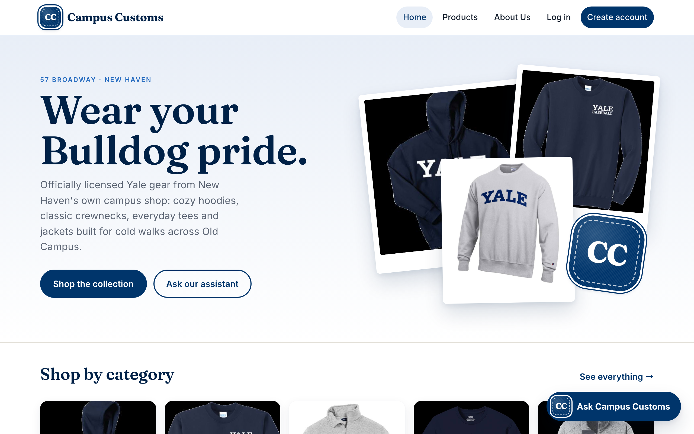
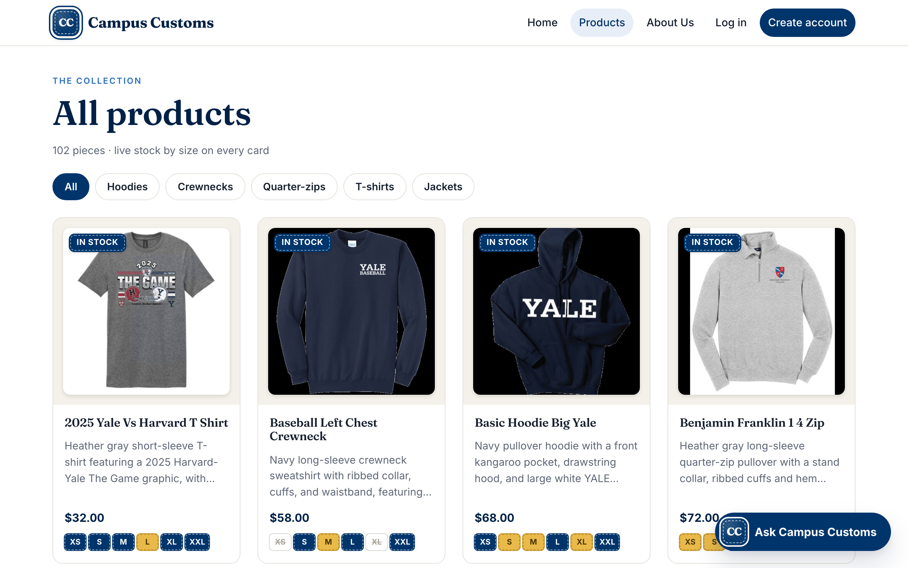
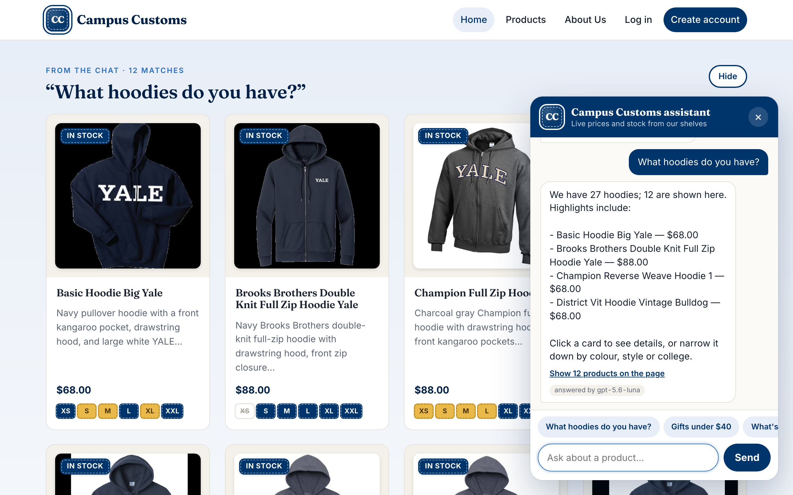

# Design: the Campus Customs storefront

The default Vite look is replaced with a store that feels like a New Haven campus shop. Below is what changed and why each change should help shoppers stay and buy.

## What changed and why

| Change | Why it helps customers stay and buy |
|---|---|
| **Yale blue (`#00356B`) as the one anchor colour**, with lots of white space and a warm "mat board" off-white (`#F4F1EA`) behind product photos. | Shoppers recognise the colour as Yale at a glance, which builds trust that this is real Yale merch. White space keeps the focus on the products. |
| **Serif display font (Fraunces) for headings, clean sans (Inter) for body text.** Both are bundled with the app, so nothing loads from a font CDN. | The serif gives a collegiate, heritage feel and makes product names look premium. The sans keeps descriptions, prices and stock easy to scan. |
| **A proper hero on Home:** a bold headline, the shop's address, two clear actions ("Shop the collection" and "Ask our assistant"), and three real product photos laid out like prints pinned to a dorm wall. | Shoppers know within a second what we sell, where we are and what to do next. Each print links straight to its product. |
| **Shop by category tiles** on Home, and **category filter pills** on Products (Hoodies, Crewnecks, Quarter-zips, T-shirts, Jackets). | Shoppers find what they came for faster. Filtering by garment family hides the messy `garment_type` text from them. |
| **Product cards:** each photo sits on a mat like a framed print, with a hover lift and a gentle image zoom. The price sits next to per-size stock patches. | Mixed black and white photo backgrounds look deliberate instead of messy. The hover response makes cards feel clickable. Price and stock in one glance means fewer dead-end clicks. |
| **Detail page:** a sticky photo, a garment-type eyebrow, a large serif price, colour swatches, size tiles with stock patches, and an "Ask about this item" button. | Everything needed to decide is above the fold, and the chat is one tap away for questions. |
| **On-brand chat:** a Yale-blue header with the CC patch, blue shopper bubbles, chip suggestions, a rounded input, and a pill-shaped "Ask Campus Customs" launcher. | The assistant feels like part of the store, not a bolted-on widget. That encourages shoppers to ask, and asking leads to product cards. |
| **Mobile:** a Menu button collapses the nav, the grid drops to two columns, and the chat becomes a bottom sheet. Tested at 390px wide with no horizontal scroll. | Many students shop on their phones. Everything stays usable with a thumb. |

## Signature touch: varsity letter-jacket patches

- The brand monogram is a **"CC" chenille patch**: Yale-blue felt with a stitched seam and a white "rim", like a letter on a varsity jacket. It appears in the nav, the hero (tilted, stuck on the photo board), the chat header, the chat launcher and the footer.
- **Stock badges are the same felt patches:**
  - Blue for **In stock**.
  - Gold for **Low stock / Only N left**.
  - Grey felt with the size struck through for **Sold out**.
- **Chat result cards glide onto the page** in a short staggered sequence.

The patches make the shop memorable and tie stock information into the brand instead of looking like warning labels. The monogram is our own "CC" rather than Yale's marks.

## Motion and accessibility

- **Subtle motion only:** card lift and zoom, the chat panel easing in, and chat cards gliding in with a 60 ms stagger.
- **`prefers-reduced-motion: reduce`** turns all transitions and animations off. We checked that cards then report a transition time of ~0s.
- **Keyboard and screen readers:** visible focus rings in Yale's lighter blue, real buttons and links, `aria-pressed` on filter pills, and labelled chat controls.

## Screenshots

### Home

### Products

### Open chat with search results

## Re-tested after the restyle

- **Chat search:** "What hoodies do you have?" gave 12 hoodie cards plus the reply. Clicking a chat card ("Do you have any jackets?", then Benjamin Franklin Fleece Jacket) opened its detail page.
- **Chips and filters:** the "Gifts under $40" chip gave 12 cards, all $32.00. The category filters show 27 hoodies, 29 crewnecks, 11 quarter-zips, 25 T-shirts and 8 jackets. The two performance shirts appear only under All.
- **Stock badges:** Baseball Left Chest Crewneck shows XS Sold out, S In stock · 15, M Only 5 left, L In stock · 25, XL Sold out, XXL In stock · 25, matching the inventory table.
- **Similar items:** sold-out XL alternatives and the "answered by" routing tags still work. The `usability_*.png` screenshots were retaken on the new design.
