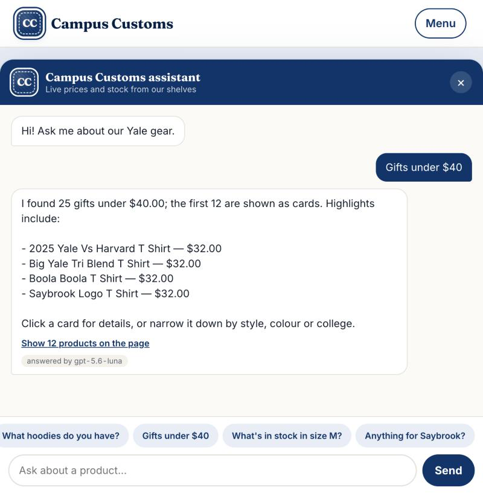
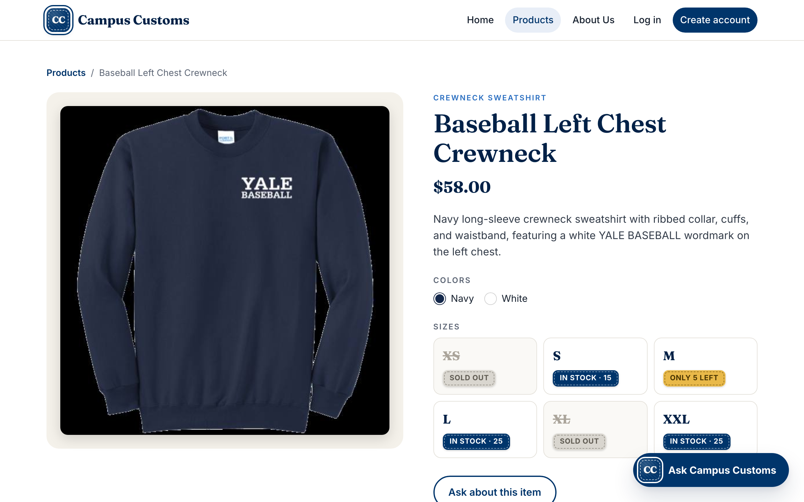
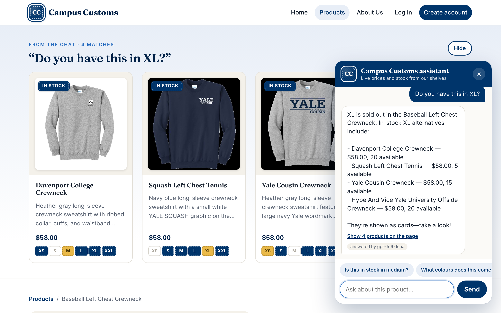
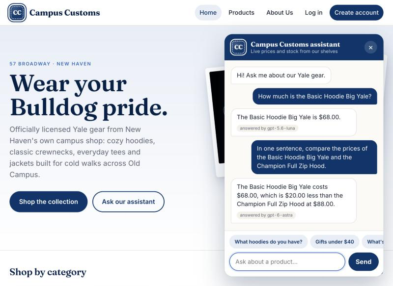

# Usability improvements

Four improvements to the Campus Customs shop: two on the frontend and two in the agent/backend. Each section says what we added and why it helps a shopper or the business. The screenshots are at the end.

## Frontend 1: Suggested question chips in the chat

**What we added**
- A row of tappable question chips above the chat input. Tapping one sends it as a message.
- Off a product page, the chips are general: "What hoodies do you have?", "Gifts under $40", "What's in stock in size M?" and "Anything for Saybrook?".
- On a product page, they're about that item: "Is this in stock in medium?", "What colours does this come in?" and "Show me something similar".
- To make every chip get a correct answer, the `search_products` tool gained two optional filters:
  - `max_price`, which keeps only products at or under the price.
  - `size`, which keeps only products with stock in that size.
- The query can now be empty when a filter is given, so "Gifts under $40" lists everything at $40 or less.

**Why it helps**
- Many shoppers don't know what a chatbot can do, and a blank text box is a dead end. Chips show the main abilities (browse, budget, size, college, product questions) in one glance.
- Starting is one tap, which matters most on a phone.
- For the business, more shoppers reach the product cards, which are one click from a product page.
- "Gifts under $40" fits a common Campus Customs visitor: a parent or friend buying a present with a budget in mind.

## Frontend 2: Stock badges on cards and the detail page

**What we added**
- Every product card shows a summary badge plus one small pill per size, using three levels from the live inventory:
  - **In stock:** more than 5 units.
  - **Low stock:** 1 to 5 units ("Only 3 left").
  - **Sold out:** 0 units.
- The detail page shows the same badge for each size, with the exact count.
- The agent's stock tool uses the same three levels, so the chat and the page always agree.

**Why it helps**
- Nobody falls in love with a hoodie, picks a size and only then finds it's gone. Shoppers can skip sold-out sizes before they click.
- "Low stock" honestly signals that a size may sell out soon, which helps a hesitant shopper decide.
- For the business, fewer frustrated "is this available?" questions, and a nudge towards sizes we actually have.

## Agent/backend 1: Similar-items tool

**What we added**
- A new `find_similar_items` tool. Given a product, and optionally a size, it returns up to 4 **in-stock** alternatives (in that size, if one was given):
  - from the same garment family (hoodie, crewneck, quarter-zip, T-shirt or jacket),
  - ranked by shared tags and colours and by closeness in price.
- These alternatives also appear as product cards on the page.
- The prompt tells the agent to call it whenever a product or size is sold out, or when the shopper asks for something similar.

**Why it helps**
- "Sold out" stops being a dead end. The shopper immediately sees something they can actually buy, in their size.
- For the business, this turns a lost sale into a likely sale, and moves stock that's sitting on the shelves.

## Agent/backend 2: Model routing with an "answered by" tag

**What we added**
- A small router in `agent.py` picks the model before each run.
  - **Simple lookups** go to `gpt-5.6-luna`: one product's price or stock, greetings, single searches.
  - **Harder multi-step questions** go to `gpt-6-astra`: comparisons, recommendations, "something similar" / alternatives, or a message combining two or more constraints (budget, size, colour).
  - A single filter, such as a budget in "Gifts under $40", stays on `gpt-5.6-luna`.
- Each reply records which model answered:
  - saved in a new `model` column on `chat_messages` (added at backend startup if missing),
  - logged with its token usage in `output/audit_trail.json`.
- **The "answered by <model>" tag under each bot reply is for development only.** It shows when the site runs on the Vite dev server (`npm run dev`), which is where the screenshots below were taken. It's left out of production builds (`import.meta.env.DEV`), so real shoppers don't see it.

**Why it helps, and what the logs show**
- **Browser chats behind the screenshots** (typed or tapped in the real browser UI, logged in `output/audit_trail.json`):

  | Run | Question | Model | Tokens (in / out / total) |
  |---|---|---|---|
  | `46aa098617d3` | "Gifts under $40" chip | gpt-5.6-luna | 4,467 / 127 / 4,594 |
  | `fd0a607ded13` | "How much is the Basic Hoodie Big Yale?" | gpt-5.6-luna | 3,778 / 46 / 3,824 |
  | `e7b14cc2a92e` | Price comparison of two hoodies | gpt-6-astra | 3,726 / 90 / 3,816 |

- **Routing sends simple questions to luna.** Across the 12 runs with token counts (the 4 browser chats plus the scripted test runs at 03:00-03:01), 10 went to gpt-5.6-luna. The 2 that went to gpt-6-astra were both price comparisons.
- **No token or cost saving is measured.** Token counts per run are similar on both models: luna runs with one tool call used 3,824-5,615 tokens, and both astra comparisons used 3,816. So we don't claim a token saving. Any cost or speed benefit would come from luna's per-token price or latency, which these logs don't measure.
- **What it does give us:** a clear, logged decision about which model handled each question, with its token cost. The "answered by" tag in development makes that easy to check while testing.

## Screenshots

### Suggested question chips

Taken in the real browser UI (the in-app browser at about 700px wide, so the chat opens as a full-width sheet over the cards). Tapping the "Gifts under $40" chip ran `46aa098617d3`: gpt-5.6-luna called `search_products` with `max_price: 40` and reported 25 matches. All 12 cards it put on the page are $32.00, the cheapest price in the catalogue.

### Stock badges

Baseball Left Chest Crewneck. The inventory table has XS 0, S 15, M 5, L 25, XL 0 and XXL 25, so the page shows Sold out, In stock · 15, Only 5 left, In stock · 25, Sold out and In stock · 25.

### Similar items for a sold-out size

"Do you have this in XL?" on the same product: the agent says XL is sold out, then calls `find_similar_items`. It shows four $58.00 crewnecks that have XL in stock (Davenport College Crewneck 20, Squash Left Chest Tennis 5, Yale Cousin Crewneck 15, Hype And Vice Offside Crewneck 20).

### Model routing tag

Taken in the real browser UI on the dev server, where the tag is shown. The price lookup (run `fd0a607ded13`) was answered by `gpt-5.6-luna`. The comparison (run `e7b14cc2a92e`) was routed to `gpt-6-astra` and answered $68.00 vs $88.00, which matches the catalogue.
